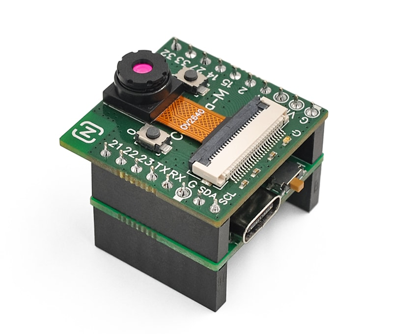

## Node-Matrix Camera-M

### Description
Camera-M is a camera module based on the ESP32 chip, integrating 4MB Flash and 8MB PSRAM. It features the OV2640 image sensor, capable of capturing photos with a resolution of 1600×1200 or performing Wi-Fi video transmission.

Camera-M shares the same set of exposed ports as the [Camera-1](https://github.com/nodematrix/Node-Matrix_Camera-1) module, including 10 GPIO, UART, and I2C interfaces. The compactly designed Camera-M has a smaller footprint and, through the optional Basic expansion board, provides a USB serial port, SD card slot, and charging management functionality.
